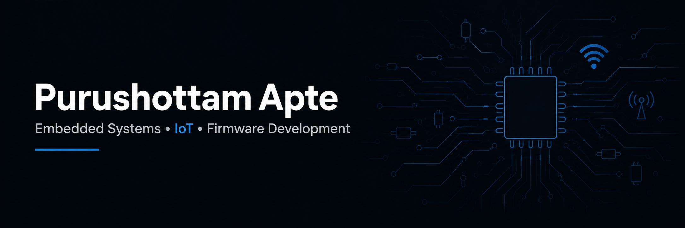

  

## 👋 Welcome!

Electronics & Telecommunication Engineering student with a strong interest in **Embedded Systems, IoT, and Firmware Development**.

I enjoy designing embedded solutions using microcontrollers, sensors, communication protocols, and cloud-connected devices while continuously expanding my knowledge of modern embedded technologies.

## 🛠 Tech Stack

### Programming Languages

  

### Embedded Platforms

  
  
  

### Development Tools

  

### Hardware & Protocols

- UART
- SPI
- I²C
- MQTT
- Wi-Fi
- KiCad
- Arduino IDE
- PlatformIO

## 🚀 Featured Projects

### 🔹 Attendify 

IoT Biometric Attendance System using **ESP32, R307 Fingerprint Sensor, Firebase, OLED Display, and React Dashboard**.

### 🔹 Underground Cable Fault Detection System

IoT-enabled underground cable fault detection using **Arduino UNO, ESP8266, MQTT, and Adafruit IO**.

### 🔹 Portfolio Website

A responsive portfolio showcasing my projects, skills, and engineering work.

---

## 🌱 Currently Learning

* Linux
* Python
* SQL
* Git & GitHub

---

## 📫 Connect With Me

🌐 **Portfolio:** https://portfolio-zeta-murex-cawoef54bd.vercel.app/

💼 **LinkedIn:** https://www.linkedin.com/in/purushottam-apte/

📧 **Email:** [aptepuru19@gmail.com](mailto:aptepuru19@gmail.com)

---
